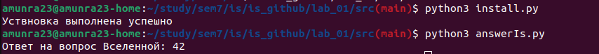

# Защита Информации

 [Я в Телеграм](https://t.me/amunra2) 

# Лабораторная работа №1

__Операционная система:__ Linux

## Цель

Целью данной работы является создание программы, которая запускается только на компьютере, на котором она была установлена.

## Детали реализации

1. Запускаемый файл создается по шаблону, который находится в файле [install.py](./src/install.py). В него встраивается ключ.
2. Ключом является _постоянный параметр_. В данной реализаци ключ - это уникальный ID системы, который создается при установке операционной системы. Берется из системного файла `/var/lib/dbus/machine-id`.
3. Установленный файл `answerIs.py` на другом компьютере не может быть запущен. Для этого нужно произвести установку непосредственно на используемом компьютере.

## Ссылки

[Код](./src)

## Запуск

### Основное приложение

1. Установить пакеты `python3`

2. Перейти в папку с исходным кодом
   
```bash
cd ./src
```

2. Запустить установщик
   
```bash
python3 install.py
```

3. Запустить программу
   
```bash
python3 answerIs.py
```

## Пример



_@amunra2 (2022г.)_
