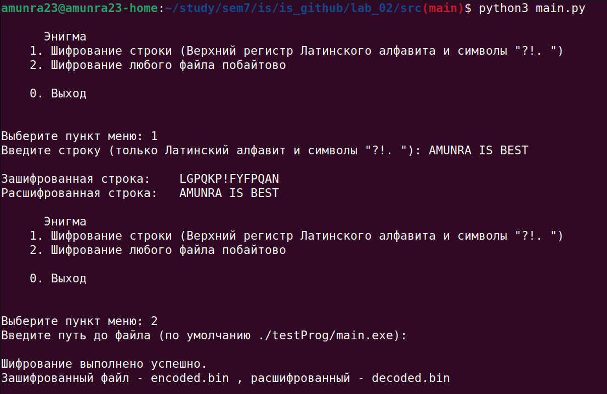

# Защита Информации

# Лабораторная работа №2

## Цель

Целью данной работы является создание программы, которая повторяет работу шифровального аппарата "Энигма".

## Детали реализации

1. Шифрование должно выполняться для любого файла (шифрование файлов побайтово)
2. Рефлектор должен иметь зеркальное соответствие (по `X` возвращается `Y`, по `Y` - `X`)

## Ссылки

[Весь Код](./src)

[Конфигурационный файл](./src/config.py)

[Исходный код шифровальной машины "Энигма"](./src/main.py)

[Программа для сравнения файлов байтово](./src/compare/)

[Тестовая программа для шифрования по умолчанию](./src/testProg/)

[Результат шифровки-дешифровки](./src/result/)


## Запуск

### Программа для сравнения файлов побайтово

0. Установить пакеты `python3`

1. Перейти в папку с исходным кодом
   
```bash
cd ./src/compare
```

2. Запустить программу
   
```bash
python3 compare.py
```


### Тестовая программа для шифрования по умолчанию

0. Установить пакеты `make`

1. Перейти в папку с исходным кодом
   
```bash
cd ./src/testProg
```

2. Собрать `EXE` файл
   
```bash
make
```

3. (При желании) Запустить

```bash
./main.exe
```


### Основное приложение

0. Установить пакеты `python3`

1. Перейти в папку с исходным кодом
   
```bash
cd ./src
```

2. Запустить программу
   
```bash
python3 main.py
```

3. Выбрать одну из двух опций:
   1. Шифровка-дешифровка строки: Латинский алфавит в Верхнем регистре и символы `'?!, '`
   2. Шифровка-дешифровка Любого файла побайтово

4. Перейти в папку с получившимися файлами шифровки-дешифровки:

```bash
cd ./result
```

Далее рассматривается сценарий __по умолчанию__ (если [конфигурационный файл](./src/config.py) не был изменен)

5. Выдать права файлам на запуск
   
```bash
chmod u+x encoded.bin
chmod u+x decoded.bin
```

6. Запустить файл `encoded.bin` - выведется мусор (это зашифрованный файл)

```bash
./encoded.bin
```

7. Запустить файл `decoded.bin` - выведется то же, что и при запуске файла [приложения для теста по умолчанию](./src/testProg/) (это расшифрованный файл)

```bash
./encoded.bin
```


## Пример



## Часто задаваемые вопросы

### Вопроc: Как заполняется ротор?

__Ответ__: Пермешивание изначального алфавита


### Вопроc: Как заполняется рефлектор?

__Ответ__: Попарно в виде словаря - берутся по два символа алфавита и первый становится ключом для второго, а второй - ключом для первого


### Вопроc: Как отличается размер шифрованного файла от начального?

__Ответ__: Никак, байт в байт идентичны


### Вопроc: Чем отличается процесс шифровки от дешифровки?

__Ответ__: Ничем


### Вопроc: Если длина файла m символов, то сколько раз повернется 1-й ротор? а второй? а третий?

__Ответ__: m; m//256; m//(256**2)


### Вопроc: По какому принципу работает ротор?

__Ответ__: Прямой ход:
1. Находится позиция ПРИШЕДШЕЙ буквы = позиция в ОБЫЧНОМ алфавите + СМЕЩЕНИЕ по ротору (позиция)
2. По найденной позиции берется буква из ПЕРЕМЕШАННОГО алфавита

Обратный ход:
1. Находится позиция ПРИШЕДШЕЙ буквы = позиция в ПЕРЕМЕШАННОМ алфавите - СМЕЩЕНИЕ по ротору (позиция)
2. По найденной позиции берется буква из ОБЫЧНОГО алфавита

Вращается ротор: 1ый - на каждом элементе, 2ой - когда повернется 1ый, 3ий - когда повернется 2ой и тд


### Вопроc: Какое главное свойство рефлектора?

__Ответ__: Рефлектор должен иметь зеркальное соответствие (по `X` возвращается `Y`, по `Y` - `X`) (поэтому алфавит должен быть четного размера)


### Вопроc: Зачем нужен рефлектор?

__Ответ__: Рефлектор нужен для того, чтобы на одних и тех же настройках (одинакое положение роторов, одинаковые алфавиты) использовать машину как для шифрования, так и дешифрования

