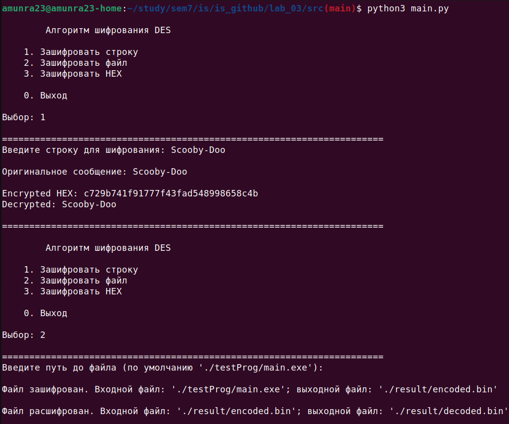

# Защита Информации

 [Я в Телеграм](https://t.me/amunra2) 

# Лабораторная работа №3

## Цель

Целью данной работы является создание программы, которая реализует алгоритм шифрования `DES`.

## Детали реализации

1. Шифрование должно выполняться для _любого_ файла (шифрование файлов побайтово)

## Ссылки

[Весь Код](./src)

[Конфигурационный файл](./src/config.py)

[Исходный код алгоритма шифрования "DES"](./src/des.py)

[Тестовая программа для шифрования по умолчанию](./src/testProg/)

[Результат шифровки-дешифровки](./src/result/)


## Запуск

### Тестовая программа для шифрования по умолчанию

0. Установить пакеты `make`

1. Перейти в папку с исходным кодом
   
```bash
cd ./src/testProg
```

2. Собрать `EXE` файл
   
```bash
make
```

3. (При желании) Запустить

```bash
./main.exe
```


### Основное приложение

0. Установить пакеты `python3`

1. Перейти в папку с исходным кодом
   
```bash
cd ./src
```

2. Установить необходимые зависимости

```bash
pip install -r requirements.txt
```

3. Запустить программу
   
```bash
python3 main.py
```

4. Выбрать одну из трех опций:
   1. Зашифровать строку
   2. Зашифровать файл
   3. Зашифровать HEX

В случае зашифровки файла

5. Перейти в папку с получившимися файлами шифровки-дешифровки:

```bash
cd ./result
```

Далее рассматривается сценарий __по умолчанию__ (если [конфигурационный файл](./src/config.py) не был изменен)

6. Выдать права файлам на запуск
   
```bash
chmod u+x encoded.bin
chmod u+x decoded.bin
```

7. Запустить файл `encoded.bin` - выведется мусор (это зашифрованный файл)

```bash
./encoded.bin
```

8. Запустить файл `decoded.bin` - выведется то же, что и при запуске файла [приложения для теста по умолчанию](./src/testProg/) (это расшифрованный файл)

```bash
./encoded.bin
```


## Пример



_@amunra2 (2022г.)_
