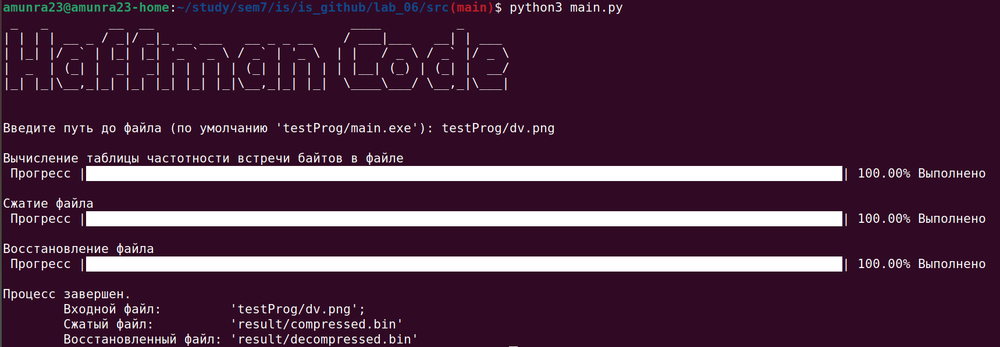

# Защита Информации

 [Я в Телеграм](https://t.me/amunra2) 

# Лабораторная работа №6

## Цель

Целью данной работы является создание программы, которая реализует алгоритм сжатия Хаффмана.

## Детали реализации

Работа должна выполняться для _любого_ файла (шифрование файлов побайтово)

## Ссылки

[Весь Код](./src)

[Конфигурационный файл](./src/config.py)

[Тестовая программа для шифрования по умолчанию (также для шифровки можно использовать приложенную фотографию, архив)](./src/testProg/)

[Результат](./src/result/)


## Запуск

### Тестовая программа для шифрования по умолчанию

0. Установить пакеты `make`

1. Перейти в папку с исходным кодом
   
```bash
cd ./src/testProg
```

2. Собрать `EXE` файл
   
```bash
make
```

3. (При желании) Запустить

```bash
./main.exe
```


### Основное приложение

1. Установить пакеты `python3`

2. Перейти в папку с исходным кодом
   
```bash
cd ./src
```

3. Установить необходимые зависимости
```bash
pip install -r requirements.txt
```

4. Запустить программу
   
```bash
python3 main.py
```

5. Ввести путь до файла, который нужно будет сжать


6. Перейти в папку с получившимися файлами сжатия и разжатия:

```bash
cd ./result
```

Далее рассматривается сценарий __по умолчанию__ (если [конфигурационный файл](./src/config.py) не был изменен)

7. Выдать права файлам на запуск
   
```bash
chmod u+x compressed.bin
chmod u+x decompressed.bin
```

8. Запустить файл `compressed.bin` - выведется мусор (это сжатый файл)

```bash
./compressed.bin
```

9. Запустить файл `decompressed.bin` - выведется то же, что и при запуске файла [приложения для теста по умолчанию](./src/testProg/) (это расшифрованный файл)

```bash
./decompressed.bin
```


## Пример



_@amunra2 (2022г.)_
