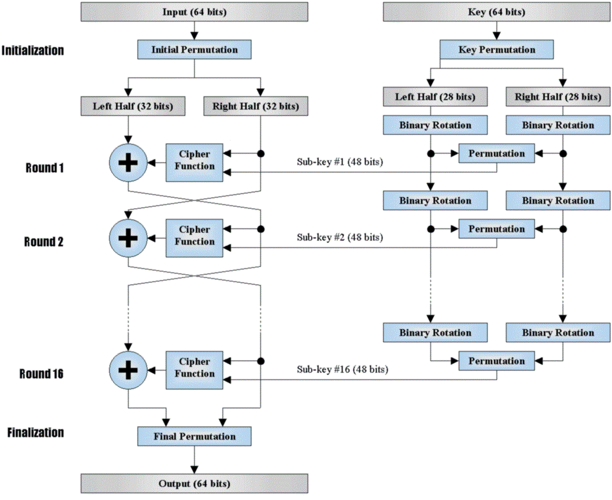
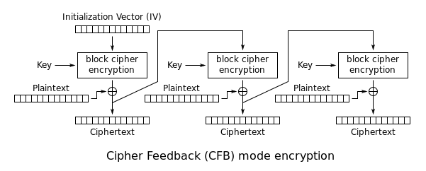

# DES CFB
### Encode 
./a.exe [name_file] e
### Decode
./a.exe [name_file] d

# DES CFB
DES - Data Encryption Standard.

Это алгоритм для симметричного шифрования, в которых отправитель и получатель используют один и тот же ключ.

CFB (англ. cipher feed back) — режим обратной связи по шифротексту.

Ключ: 64 бит (8 байт).

# Этапы шифрования DES
### I.  Преобразование ключа
64 бит -> 16 x 48 бит
1.	Переставить биты исходного ключа, исключая каждый 8-й бит (бит четности)
2.	Разделить на 2 половины по 28
3.	Сдвинуть каждую половину на 1 или 2 бита
4.	Объединить в 56 бит
5.	Сжать до 48 бит
6.	Повторить 16 раз с п.2

### II Функция Фейстеля
1.	Е - расширяющая перестановка R
2.	xor с K(i)
3.	S-замены
4.	Конечная перестановка P

### III Шифрование текста (использует функцию Фейстеля)
Алгоритм:
1.	Начальная перестановка IP
2.	Разделить на L и R
3.	L’=R
4.	R’=L+f(R,Ki)
5.	Повторить 16 раз с п.3
6.	Конечная перестановка IP-1

### IV Расшифровка текста (использует функцию Фейстеля)
Выполняется в обратном порядке:
1.	Перестановка по таблице начальной перестановки (так как она взаимно обратна конечной)
2.	На каждом из 16 раундов:
R(i-1)=L(i)
L(i-1)=R(i) +F(R(i), K(i))
3.	На последнем шаге получаем L(0)+R(0) и переставляем в соответствии с таблицей конечной перестановки

# Вопросы

1. Как работает функция Фейстеля?

Просто по коду своими словами объяснить

2. Как получается значение из S-блоков?

6 битов на вход, 4 на выход. S-блок -- таблица из 4 строк и 16 столбцов. По
первому и последнему битам (00, 01, 10, 11) получем номер строки, по оставшимся
четырем (как раз 16 значений: 0000, 0001, ..., 1111) номер столбца, получаем
этим значениям и по таблице S-блока новое число от 0 до 15 (4 бита).

3. Что происходит при шифровании/расшифровке?

Начальная перестановка, разделение на левую и правую половины, swap при
расшифровке, 16 раундов (xor левой половины с функцией Фейстеля правой + swap),
swap при расшифровке, перестановка, обратная начальной.

4. Почему не меняем начальную и конечную перестановки?

Потому что конечная является обратной по отношению к начальной